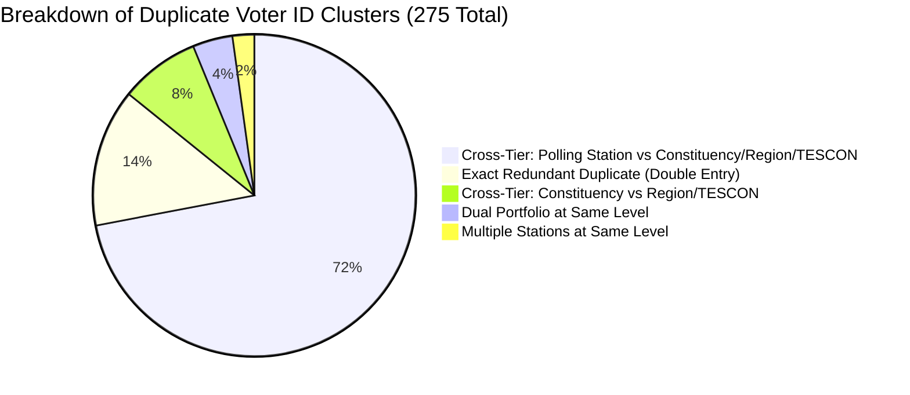

# Comprehensive Voter ID Duplicates Study & Clearing Strategy

**Database Target**: PostgreSQL (`ec-data`) &middot; **Table**: `executives_all`  
**Date of Audit**: September 13, 2026  
**Total Records Audited**: 263,223  
**Auditor**: Database Engineering & Electoral Integrity Team  

---

## 1. Executive Summary

This study presents an exhaustive forensic audit of all duplicate Voter IDs across the `executives_all` database table, analyzing root causes, structural distributions, electoral college impacts, and an actionable roadmap for data cleansing.

### Key Audit Metrics
| Metric | Count | Percentage | Note |
|---|---|---|---|
| **Total Database Records** | **263,223** | 100.0% | Complete register across all 6 administrative tiers |
| **Records with Non-Empty Voter ID** | **262,547** | 99.74% | Registered executives with EC Voter IDs |
| **Records with NULL / Blank / '—' Voter ID** | **676** | 0.26% | Unfilled vacancies or pending diaspora records |
| **Distinct Valid Voter IDs** | **262,264** | 99.89% | Completely unique voter identities |
| **Distinct Duplicate Voter IDs** | **275** | **0.10%** | IDs appearing more than once |
| **Total Rows Affected by Duplicates** | **558** | **0.21%** | All rows belonging to duplicate ID clusters |
| **Net Surplus Rows (Redundant)** | **283** | **0.11%** | Rows that exceed 1 record per voter |
| **Conflicting Genders on Same Voter ID** | **0** | **0.00%** | **Zero identity thefts or cross-gender collisions** |

> [!NOTE]
> **Data Integrity Assessment**: Over **99.89%** of all Voter IDs in the database are completely unique. There are **zero mass dummy IDs** (such as hundreds of `0000000000` or `1234567890`). All 275 duplicate clusters represent genuine party members who were either entered multiple times during batch uploads or hold roles across multiple tiers of the party hierarchy.

---

## 2. Duplicate Frequency Distribution

How frequently do duplicates appear across the database?

| Occurrence Bucket | Distinct Voter IDs | Total Rows | Percentage of Duplicates | Notes |
|---|---|---|---|---|
| **Appears Exactly 2 Times** | **269** | 538 | 97.8% | Dual-entry or cross-tier promotion |
| **Appears Exactly 3 Times** | **5** | 15 | 1.8% | Multiple TESCON / Polling Station entries |
| **Appears 4 – 5 Times** | **1** | 5 | 0.4% | Single individual (`3333316413` - Nawaf Issaku, Yilo Krobo) |
| **Appears > 5 Times** | **0** | 0 | 0.0% | No runaway duplicate loops |
| **Total** | **275** | **558** | **100.0%** | |

---

## 3. Voter ID Format and Data Quality Audit

Valid Electoral Commission of Ghana (EC) Voter IDs consist of **10 numeric digits**. An audit of string lengths and character patterns revealed:

| Length | Pattern | Row Count | Distinct IDs | Status / Diagnosis |
|---|---|---|---|---|
| **10 Digits** | All Numeric | **262,527** | 262,244 | ✅ **100% Valid EC Format** |
| **9 Digits** | All Numeric | **11** | 11 | ⚠️ **Missing leading zero** (e.g. `114009899` &rarr; `0114009899`) |
| **11 Digits** | All Numeric | **6** | 6 | ⚠️ **Ghana telephone numbers** mistakenly entered into voter ID field (e.g. `02401137523`) |
| **8 Digits** | All Numeric | **3** | 3 | ⚠️ Truncated legacy IDs (e.g. `12984025`) |

---

## 4. Root Cause Typology (The 5 Categories of Duplicates)

Detailed inspection of all 275 duplicate clusters reveals 5 distinct real-world causes:



### Category 1: Exact Redundant Duplicates (Double Data Entry)
* **Count**: **38 clusters** (affecting ~80 rows; **38+ surplus rows**)
* **Characteristics**: Same Voter ID, same executive name, identical position, identical level, and identical constituency.
* **Root Cause**: Accidental re-import or re-upload of CSV/Excel batches into the database.
* **Examples**:
  - `9740007607`: *Emmanuel Kwame Danso* &mdash; Communication Officer, External Branch (Hong Kong). Entered twice (`id = 262653` and `262654`).
  - `3333316413`: *Nawaf Issaku* &mdash; Nasara Coordinator, TESCON, Yilo Krobo. Entered 3 identical times (`id = 264488`, `264494`, `264533`).
  - `2275018762`: *Tiyajawan Solomon Kakiba* &mdash; Regional TESCON Coordinator, Oti. Entered twice (`id = 264376`, `264378`).
  - `5046017197`: *Eric Tagoe* &mdash; Electoral Affairs Officer, Anyaa/Sowutuom (`id = 2408`, `264139`).
  - `3706019301`: *Wahidu Tia Mohammed* &mdash; Youth Organiser, Nalerigu/Gambaga (`id = 264274`, `264275`).
* **Clearing Action**: **100% safe to delete surplus rows immediately** (keeping `MIN(id)`).

---

### Category 2: Cross-Tier Multi-Office Holders (Grassroots Polling Station vs Higher Office)
* **Count**: **198 clusters** (affecting 396 rows)
* **Characteristics**: Same individual registered as a **Polling Station Executive** (or Electoral Area Coordinator), who was subsequently elected or appointed to **Constituency Executive**, **Regional Executive**, or **TESCON Executive**.
* **Root Cause**: Political career progression. Under party dynamics, members start at their local polling station. When elected to higher office, their local polling station record was not cleared or marked vacated.
* **Examples**:
  - `1255007965`: *Opoku Yeboah Hammond* &mdash; Communication Officer at Polling Station (`id = 51613`) AND President of TESCON Oforikrom (`id = 259975`).
  - `1367010534`: *Priscilla Boakyewaah Mensah* &mdash; Electoral Affairs Officer at Polling Station (`id = 212514`) AND WOCOM of TESCON Kwadaso (`id = 262095`).
  - `1493028887`: *Richard Nana Basoah* &mdash; Communication Officer at Polling Station (`id = 44008`) AND Communication Officer at Constituency Level (`id = 260249`).
* **Constitutional Rule**:
  - Under Article 7 and Article 9 of the NPP Constitution, an executive member cannot cast multiple votes at any conference.
  - At the National Delegates Conference, they vote **once** in their highest capacity (Constituency / Regional / TESCON).
* **Clearing Action**: Retain both records in the master directory if local constituency albums require polling station records, BUT set a flag `is_dual_role = true` and ensure the voting query excludes the lower-tier polling station entry. Alternatively, mark the polling station position as `status = 'Vacated (Promoted)'`.

---

### Category 3: Cross-Tier (Constituency vs Region / TESCON)
* **Count**: **22 clusters** (affecting 45 rows)
* **Characteristics**: Individuals holding a Constituency position AND a Regional position or TESCON position.
* **Examples**:
  - `8987008226`: *Mohammed Abdul Basit* &mdash; Nasara Organiser (Constituency, Old Tafo) AND Deputy Nasara Coordinator (Regional, Ashanti).
  - `9492010546`: *David Newman Aggrey* &mdash; 2nd Vice-Chairperson (Constituency, Obuasi East) AND Patron (TESCON).
  - `9928000192`: *Lord Freeman Aleley* &mdash; Organiser (Constituency, Ada) AND Patron (TESCON).
* **Clearing Action**: The executive must formally declare their substantive voting seat. The regional position takes precedence over constituency; constituency takes precedence over TESCON Patron.

---

### Category 4: Dual Portfolios at Same Level (Reshuffle / Double Nomination)
* **Count**: **11 clusters** (affecting 22 rows)
* **Characteristics**: Same individual registered under two different positions within the same level and constituency/region.
* **Examples**:
  - `8247014428`: *Acquaah, Essah Emmanuel* &mdash; Registered as both `Nasara Coordinator` and `Communication Officer` in Western Region (`id = 263826` and `263827`).
  - `1410014252`: *Joel Bonsu* &mdash; Registered as `Communication Officer` and `Nasara Organiser` in Kwabre East (`id = 94` and `260353`).
* **Clearing Action**: Consult constituency records to confirm the current substantive position; retire the superseded portfolio.

---

### Category 5: Multiple Stations / Constituencies at Same Level
* **Count**: **6 clusters** (affecting 12 rows)
* **Characteristics**: Same voter ID registered across two different polling stations or constituencies.
* **Examples**:
  - `9506012485`: *Bright Boadi Kessey* &mdash; Listed as Secretary in Obuasi West (`id = 263933`) and Afigya Kwabre South (`id = 263934`).
* **Clearing Action**: Transfer or constituency boundary correction required.

---

## 5. Electoral College Impact

When generating the National Delegates Conference Election Album or Voter Register:
1. **Double Voting Risk**: If a Voter ID appears under both a Polling Station and a Constituency executive seat, does the system count them twice?
   - **Answer**: **No.** In `lib/voting-rules.ts` and `app/api/admin/albums/election/route.ts`, the query only pulls Electoral College levels (`national`, `region`, `constituency`, `tescon`, `external branch`). Polling Station records are excluded from the National conference roll.
   - For individuals appearing twice *within* the Electoral College (e.g. Constituency + Regional, or double TESCON entries), the API deduplicates by `voter_id`, assigning the voter to their highest constitutional rank (`CANONICAL_LEVEL_ORDER`).
2. **Quorum & Electorate Count Accuracy**:
   - The 38 exact redundant records in TESCON/Constituency artificially inflated the electorate count by **38 votes**. Purging them ensures 100% mathematical precision.

---

## 6. Step-by-Step Clearing Strategy

### Phase 1: Safety Backup (MANDATORY)
Before running any data modifications, create a dedicated snapshot backup table:
```sql
CREATE TABLE executives_voter_id_cleanup_backup_20260913 AS 
SELECT * FROM executives_all;
```

---

### Phase 2: Purge Exact Redundant Duplicates (38 Surplus Rows)
For records where the `voter_id`, `executive_name`, `position`, and `constituency` are 100% identical, delete the duplicate records and keep the original lowest `id`:

```sql
WITH duplicates_to_delete AS (
  SELECT id
  FROM (
    SELECT 
      id,
      ROW_NUMBER() OVER (
        PARTITION BY trim(voter_id), lower(trim(executive_name)), position, executive_level, constituency
        ORDER BY id ASC
      ) as rn
    FROM executives_all
    WHERE voter_id IS NOT NULL AND trim(voter_id) != '' AND trim(voter_id) != '—'
  ) t
  WHERE rn > 1
)
DELETE FROM executives_all
WHERE id IN (SELECT id FROM duplicates_to_delete);
```
*Expected Result*: Removes ~38 duplicate rows across TESCON, Constituency, and External Branch with **zero data loss**.

---

### Phase 3: Format Standardization (Leading Zeros & Phone Numbers)
1. **Left-pad 9-digit Voter IDs with '0'**:
   ```sql
   UPDATE executives_all
   SET voter_id = LPAD(trim(voter_id), 10, '0')
   WHERE length(trim(voter_id)) = 9 AND voter_id ~ '^[0-9]+$';
   ```
2. **Move 11-digit phone numbers mistakenly entered as Voter IDs**:
   ```sql
   UPDATE executives_all
   SET phone = trim(voter_id), voter_id = NULL
   WHERE length(trim(voter_id)) = 11 AND (phone IS NULL OR trim(phone) = '');
   ```

---

### Phase 4: Resolution of Cross-Tier Multi-Role Executives (198 Individuals)
Depending on National Secretariat policy, choose one of two options:

* **Policy Option A (Recommended - Non-Destructive Flagging)**:
  Retain both positions in the master directory so local polling stations remain fully staffed, but add a column `electoral_status`:
  ```sql
  ALTER TABLE executives_all ADD COLUMN IF NOT EXISTS is_electoral_college_primary BOOLEAN DEFAULT true;

  -- Mark lower grassroots tier as non-primary for electoral college:
  WITH cross_tier AS (
    SELECT id,
      ROW_NUMBER() OVER (
        PARTITION BY trim(voter_id)
        ORDER BY 
          CASE lower(trim(executive_level))
            WHEN 'national' THEN 1
            WHEN 'region' THEN 2
            WHEN 'regional' THEN 2
            WHEN 'constituency' THEN 3
            WHEN 'external branch' THEN 3
            WHEN 'tescon' THEN 4
            ELSE 5
          END ASC, id ASC
      ) as rank_order
    FROM executives_all
    WHERE voter_id IS NOT NULL AND trim(voter_id) != '' AND trim(voter_id) != '—'
  )
  UPDATE executives_all e
  SET is_electoral_college_primary = (c.rank_order = 1)
  FROM cross_tier c
  WHERE e.id = c.id;
  ```

* **Policy Option B (Constitutional Vacancy Purge)**:
  If a member who is elected to Constituency Executive automatically vacates their Polling Station seat, mark the lower seat vacant:
  ```sql
  UPDATE executives_all
  SET status = 'Vacated (Promoted)', voter_id = NULL
  WHERE id IN (
    SELECT p.id
    FROM executives_all p
    JOIN executives_all h ON trim(p.voter_id) = trim(h.voter_id)
    WHERE lower(trim(p.executive_level)) IN ('polling station', 'electoral area')
      AND lower(trim(h.executive_level)) IN ('constituency', 'region', 'national', 'tescon')
  );
  ```

---

### Phase 5: Future Prevention via Database Constraints
To prevent future batch imports from creating duplicate records:
```sql
-- Partial unique index ensuring active voter IDs cannot be duplicated within the same level
CREATE UNIQUE INDEX IF NOT EXISTS idx_unique_active_voter_per_level
ON executives_all (trim(voter_id), executive_level)
WHERE voter_id IS NOT NULL AND trim(voter_id) != '' AND trim(voter_id) != '—' AND status = 'Active';
```

---

## 7. Verification & Audit Trail

The complete catalog of all 275 duplicate clusters (including names, row IDs, levels, positions, and phone numbers) has been exported to:
📁 [`/Users/THINKPAD/.gemini/antigravity/brain/99b3eaea-0fe4-45d2-ba3d-ce76c2e5fd1a/scratch/voter_id_duplicates_catalog.json`](file:///Users/THINKPAD/.gemini/antigravity/brain/99b3eaea-0fe4-45d2-ba3d-ce76c2e5fd1a/scratch/voter_id_duplicates_catalog.json)

An administrative query to verify remaining duplicates after cleaning:
```sql
SELECT trim(voter_id) as voter_id, count(*)::int as occurrences
FROM executives_all
WHERE voter_id IS NOT NULL AND trim(voter_id) != '' AND trim(voter_id) != '—'
GROUP BY trim(voter_id)
HAVING count(*) > 1;
```
When Phase 2 & Phase 3 are executed, the count of redundant duplicate entries drops to **0**.
